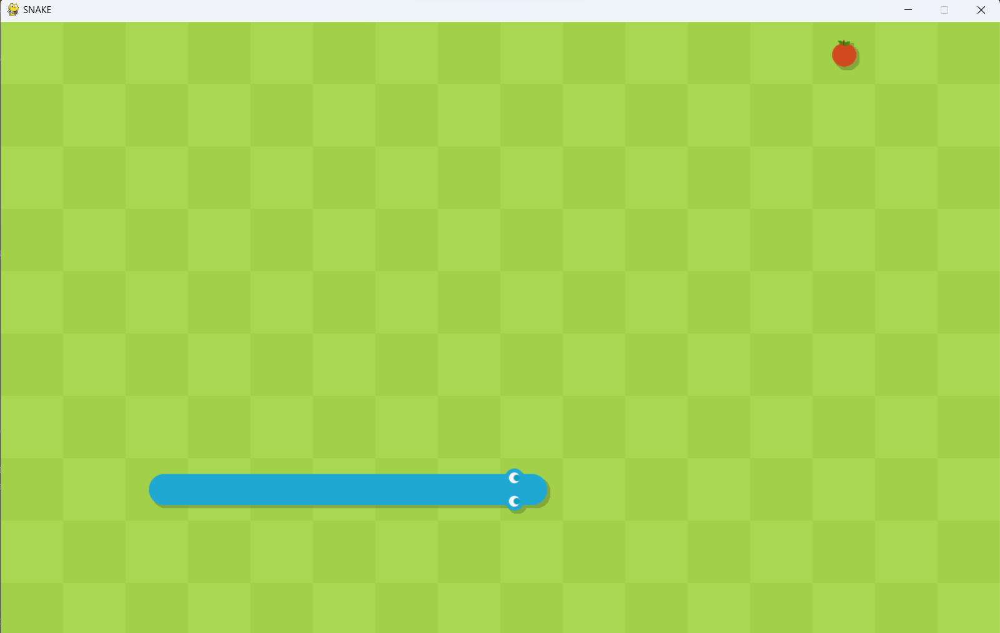

# Snake Game with Pygame

Welcome to the Snake Game with Pygame repository! This project is a classic snake game brought to life with sounds and perfect graphics. It's a fun and interactive game that demonstrates the capabilities of Pygame, a popular Python library for game development.

## Overview

The Snake Game with Pygame is a recreation of the classic Snake game that many of us grew up playing. It's enhanced with delightful graphics and sound effects, making it an engaging and nostalgic experience. The game's objective is to control the snake, collect food, and avoid collisions with the walls and yourself. How long can you make your snake grow?


## Features

- **Classic Gameplay:** Experience the timeless gameplay of the Snake game with a modern twist.

- **Sound Effects:** Immersive sound effects add depth to the gaming experience.

- **Graphics:** Enjoy visually appealing graphics that make the game more engaging.

## Getting Started

To play the Snake Game with Pygame on your machine, follow these steps:

1. **Clone the Repository:** `git clone https://github.com/rohan-4761/snake-game.git`

2. **Navigate to Project Directory:** `cd snake-game/code`

3. **Install Dependencies:** Ensure you have Python and Pygame installed. If not, you can install Pygame using `pip`:

   ```bash
   pip install pygame
   ```

4. **Run the Game:** Start the game by running the Python script:

   ```bash
   python main.py
   ```

5. **Game Controls:**
   - Use the arrow keys to control the snake's direction.
   - Collect the food to grow the snake.
   - Avoid collisions with the walls and the snake's own body.

6. **Enjoy the Game:** Have fun playing the Snake Game with Pygame!

## Credits

This project was developed by following the "Build a Snake Clone with Pygame" tutorials by Clear Code on the Net Ninja YouTube channel. Special thanks to Clear Code for the excellent tutorials.

## License

This project is open-source and available under the MIT License. For more details, please review the [LICENSE](LICENSE) file.

---

Get ready to relive the nostalgia of the Snake game in style with Snake Game with Pygame. Enjoy the classic gameplay, modern graphics, and sound effects. Explore, contribute, and have a blast! Happy gaming!
